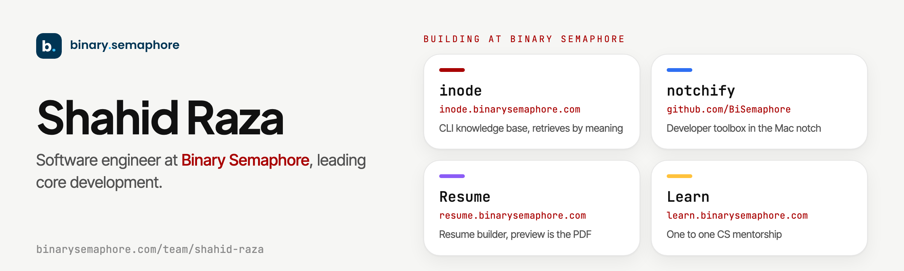

<a href="https://binarysemaphore.com/team/shahid-raza">
  <picture>
    <source media="(prefers-color-scheme: dark)" srcset="assets/banner-dark.png">
    
  </picture>
</a>

I work mostly in TypeScript and Go, on the parts of a system where getting it wrong is expensive: authentication and authorization, payments, database transactions, message queues, and concurrency control.

## Binary Semaphore

A small studio building software across AI, distributed systems, and developer tools. These are the products I build there. The full profile lives at [binarysemaphore.com/team/shahid-raza](https://binarysemaphore.com/team/shahid-raza).

| Product | What it is | Links |
| --- | --- | --- |
| **inode** | A CLI knowledge base for notes, secrets, and commands that retrieves by meaning instead of keywords. Vector search plus an LLM, running on your machine by default (Ollama and SQLite), with an optional Postgres/pgvector backend and an MCP server so tools like Claude Code can query it directly. *Go, RAG, pgvector, MCP, Ollama* | [inode.binarysemaphore.com](https://inode.binarysemaphore.com) [source](https://github.com/shahid-io/inode) |
| **notchify** | A developer toolbox that lives in the Mac camera notch: a file shelf, searchable clipboard history, JSON, Base64 and URL formatting, a color picker, and a port inspector that can free a busy port. Runs entirely on-device. *Swift, macOS* | [source](https://github.com/BiSemaphore/notchify) |
| **Resume** | A resume builder where the preview is the PDF. The on-screen preview and the print document run the same pagination module, so page breaks land in the same place on export. 21 templates, GitHub and Google sign-in, row-level security enforced in Postgres. *Next.js, Supabase, PDF* | [resume.binarysemaphore.com](https://resume.binarysemaphore.com) |

**Learn** ([learn.binarysemaphore.com](https://learn.binarysemaphore.com)): one-to-one mentorship for computer science students stuck on a specific paper or concept.

### How it is built

The apex site and every product subdomain are served by one Next.js app on Vercel. A proxy reads the request host and routes `inode.`, `resume.`, and `learn.` to their own route trees, so adding a product page is a one-line data change plus DNS. Auth and data sit in Supabase, with access rules enforced by row-level security in the database rather than remembered by application code.

### Writing

Engineering threads on [binarysemaphore.com/threads](https://binarysemaphore.com/threads):

- [How semantic search finds things you can't grep](https://binarysemaphore.com/threads/how-semantic-search-works)
- [Giving your knowledge base an MCP server](https://binarysemaphore.com/threads/an-mcp-server-for-your-notes)
- [What a binary semaphore actually is](https://binarysemaphore.com/threads/what-is-a-binary-semaphore)
- [Why TypeScript 7 is written in Go](https://binarysemaphore.com/threads/why-typescript-7-is-written-in-go)

## Stack

**Languages** TypeScript, Go, Python, Java, Swift 
**Backend** Node.js, NestJS, Express, REST, GraphQL 
**Data** PostgreSQL, MongoDB, Redis, SQLite, Kafka 
**Infrastructure** Docker, GitHub Actions, Vercel, Supabase

<b>Other projects</b>

 

- [beeline](https://github.com/shahid-io/beeline): a command palette over 80,000 records that searches entirely in the browser, p95 of 1ms per keystroke. TypeScript.
- [polaris](https://github.com/shahid-io/polaris): flight search across six providers that merges the same flight sold by different sellers into one row. NestJS, Next.js.
- [notebook-kit](https://github.com/shahid-io/notebook-kit): markdown to annotatable study-notebook PDFs with a linter and generated question bank. Python.
- [ascent](https://github.com/BiSemaphore/ascent): a cohort-based learning platform built as microservices with Kafka. NestJS, PostgreSQL, Angular.
- [booking-go](https://github.com/Booking-Go): a multi-tenant slot booking platform. Express, PostgreSQL, MongoDB, Redis.
- [inquiro](https://github.com/shahid-io/inquiro): a reactive Q&A platform. Java, Kafka.
- [orbit-queue](https://github.com/shahid-io/orbit-queue): a job scheduler with cron and retries. Go.
- [Qubit](https://github.com/shahid-io/Qubit): an in-memory key-value store. Go.

**Recently pushed** (updated weekly by a GitHub Action)

<!-- recent:start -->
- [shahid-io/beeline](https://github.com/shahid-io/beeline) pushed 2026-09-09
- [BiSemaphore/binarysemaphore.com](https://github.com/BiSemaphore/binarysemaphore.com) pushed 2026-09-07
- [shahid-io/notebook-kit](https://github.com/shahid-io/notebook-kit) pushed 2026-08-30
- [shahid-io/polaris](https://github.com/shahid-io/polaris) pushed 2026-08-16
- [BiSemaphore/ascent](https://github.com/BiSemaphore/ascent) pushed 2026-07-22
<!-- recent:end -->

## Contact

[Email](mailto:shahid@binarysemaphore.com) ·
[LinkedIn](https://linkedin.com/in/shahid-raza-2615b4129/) ·
[X](https://x.com/coderHooon) ·
[Binary Semaphore on GitHub](https://github.com/BiSemaphore)
